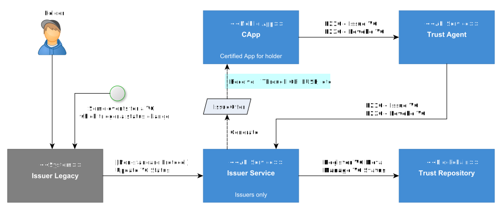

---
puppeteer:
    pdf:
        format: A4
        displayHeaderFooter: true
        landscape: false
        scale: 0.8
        margin:
            top: 1.2cm
            right: 1cm
            bottom: 1cm
            left: 1cm
    image:
        quality: 100
        fullPage: false
---

Issuer API
==

- 일자: 2024-08-19
- 버전: v1.0.0
  
목차
--

<!-- TOC tocDepth:2..3 chapterDepth:2..6 -->
  - [1. 개요](#1-개요)
  - [2. 용어 설명](#2-용어-설명)
  - [3. API 목록](#3-api-목록)
    - [3.1. 순차 API](#31-순차-api)
    - [3.2. 단일호출 API](#32-단일호출-api)
  - [4. P210 - VC 발급 프로토콜](#4-p210---vc-발급-프로토콜)
    - [4.1. Request Offer](#41-request-offer)
    - [4.2. Inspect Propose Issue](#42-inspect-propose-issue)
    - [4.3. Generate Issue Profile](#43-generate-issue-profile)
    - [4.4. Issue VC](#44-issue-vc)
    - [4.5. Complete VC](#45-complete-vc)
    - [4.6. Issue VC Result](#46-issue-vc-result)
  - [5. P220 - VC 폐기 프로토콜](#5-p220---vc-폐기-프로토콜)
    - [5.1. Inspect Propose Revoke](#51-inspect-propose-revoke)
    - [5.2. Revoke VC](#52-revoke-vc)
    - [5.3. Complete Revoke](#53-complete-revoke)
  - [6. 단일 호출 API](#6-단일-호출-api)
    - [6.1. Save User Data](#61-save-user-data)
    - [6.2. Save VC Data](#62-save-vc-data)
    - [6.3. Issue Certificate VC](#63-issue-certificate-vc)
    - [6.4. Get Certificate Vc](#64-get-certificate-vc)
    - [6.5. Get Vc Schema](#65-get-vc-schema)
    - [6.6. Update Vc Status](#66-update-vc-status)

## 1. 개요

본 문서는 Issuer Service가 제공하는 제공하는 API를 정의한다.



- 상기 그림에서는 Issuer Service가 제공하거나 혹은 Issuer Service가 호출하는 프로토콜(Protocol)과 API를 표기하였으며, API는 가독성을 위하여 표준 API (Standard API)만을 표기하였다.
- 각 용어는 2장에서 설명하며, API 목록과 호출 예시 등은 3장 이후부터 확인할 수 있다.

<div style="page-break-after: always; margin-top: 50px;"></div>

## 2. 용어 설명
- 프로토콜 (Protocol)
  - 특정 기능을 수행하기 위해 정해진 순서에 따라 호출해야 하는 `순차 API`의 집합이다. API 호출 순서를 엄격히 따라야 하며, 순서가 잘못될 경우 예상하지 못한 결과가 발생할 수 있다.
  - 프로토콜은 P로 시작하고, 3자리 숫자로 구성된다. 
    - 예시: P210 - VC 발급 프로토콜
- 순차 API (Sequential API)
  - 특정 기능(프로토콜)을 수행하기 위해 정해진 순서대로 호출하는 일련의 API를 말한다. 각 API는 순차적으로 호출되어야 하며, 순서가 잘못될 경우 제대로 동작하지 않을 수 있다.
  - 그러나 일부 프로토콜에서는 같은 호출 순서를 가진 API가 존재할 수 있으며, 이 경우 하나의 API를 선택하여 호출할 수 있다.
- 단일 호출 API (Single Call API)
  - 일반적인 REST API처럼 순서에 관계없이 독립적으로 호출 가능한 API를 의미한다.
- 표준 API (Standard API)
  - API 문서에서 명확하게 정의된 API로, 모든 구현체에서 일관된 방식으로 제공되어야 한다. 표준 API는 시스템 간 상호 운용성을 보장하며, 사전에 정의된 스펙에 따라 동작해야 한다.
- 비표준 API (Non-Standard API)
  - 구현체마다 필요에 따라 다르게 정의되거나 커스터마이징될 수 있는 API이다. 본 문서에서 제공하는 비표준 API는 한 가지 예시일 뿐이며, 각 구현체에 맞춰 다르게 구현될 수 있다. 이 경우, 구현체별 별도의 문서화가 필요하다.
  - 예를 들어, VC 정보 저장 기능은 시스템에 따라 구현 방법이 달라질 수 있으며, `save-vc-data` API와 같은 비표준 API는 각 구현체에서 필요한 방식으로 재정의할 수 있다.

<div style="page-break-after: always; margin-top: 50px;"></div>

## 3. API 목록

### 3.1. 순차 API

#### 3.1.1. P210 - VC 발급 프토토콜
| Seq | API                      | URL                                   | Description             | 표준API |
| --- | ------------------------ | ------------------------------------- | ----------------------- | ------- |
| 1   | `request-offer`          | /api/v1/request-offer          | VC 발급 Offer 요청 (QR) | N       |
| 2   | `inspect-propose-issue`  | /api/v1/inspect-propose-issue  | VC 발급 요청 확인       | Y       |
| 3   | `generate-issue-profile` | /api/v1/generate-issue-profile | Issue Profile 생성      | Y       |
| 4   | `issue-vc`               | /api/v1/issue-vc               | VC 발급                 | Y       |
| 5   | `complete-vc`            | /api/v1/complete-vc            | VC 발급 완료            | Y       |
| 6   | `issue-vc-result`        | /api/v1/issue-vc/result        | VC 발급 결과 확인       | N       |

<div style="page-break-after: always; margin-top: 40px;"></div>

#### 3.1.2. P220 - VC 폐기 프로토콜
| Seq | API                      | URL                                      | Description       | 표준API |
| --- | ------------------------ | ---------------------------------------- | ----------------- | ------- |
| 1   | `inspect-propose-revoke` | /api/v1/vc/inspect-propose-revoke | VC 폐기 요청 확인 | Y       |
| 2   | `revoke-vc`              | /api/v1/vc/revoke-vc                 | VC 폐기 요청      | Y       |
| 3   | `complete-revoke`        | /api/v1/vc/complete-revoke           | VC 폐기 완료      | Y       |

<div style="page-break-after: always; margin-top: 40px;"></div>

### 3.2. 단일호출 API
| API                    | URL                           | Description          | 표준API |
| ---------------------- | ----------------------------- | -------------------- | ------- |
| `save-user-data`       | /api/v1/user           | 사용자 정보 저장     | N       |
| `save-vc-data`         | /api/v1/vc             | VC 정보 저장         | N       |
| `issue-certificate-vc` | /api/v1/certificate-vc | Entity 등록 요청     | N       |
| `get-certificate-vc`   | /api/v1/certificate-vc | 가입증명서 조회 요청 | N       |
| `get-vcschema`         | /api/v1/vc/vcschema    | VC 스키마 조회       | N       |
| `update-vc-status`     | /api/v1/vc/status      | VC 상태 변경         | N       |

<div style="page-break-after: always; margin-top: 50px;"></div>

## 4. P210 - VC 발급 프로토콜

| Seq. | API                    | Description        | 표준API |
| :--: | ---------------------- | ------------------ | ------- |
|  1   | request-offer          | VC 발급 Offer 요청 | N       |
|  2   | inspect-propose-issue  | VC 발급 요청 확인  | Y       |
|  3   | generate-issue-profile | Issue Profile 생성 | Y       |
|  4   | issue-vc               | VC 발급            | Y       |
|  5   | complete-vc            | VC 발급 완료       | Y       |
|  6   | issue-vc-result        | VC 발급 결과 확인  | N       |

### 4.1. Request Offer 

VC 발급을 위해 발급 세션 정보를 요청하는 과정이다. Issuer(발급자)는 발급할 VC와 관련된 사용자의 정보를 미리 알고 있어, 발급 세션 정보를 인가앱에 제공할 수 있다. 이 발급 세션 정보는 Issue Offer라고 하며, 사용자는 이 정보를 통해 발급 절차를 시작할 수 있다.

예를 들어, 특정 기관의 직원만 발급받을 수 있는 공무원증과 같은 경우, 해당 직원의 정보는 이미 등록되어 있으며, 발급자는 이를 바탕으로 발급 세션을 생성한 후 제공할 수 있다.

| Item          | Description             | Remarks |
| ------------- | ----------------------- | ------- |
| Method        | `POST`                  |         |
| Path          | `/api/v1/request-offer` |         |
| Authorization | -                       |         |

#### 4.1.1. Request

**■ Path Parameters**

N/A

**■ Query Parameters**

N/A

**■ HTTP Body**

```c#
def object RequestOffer: "Request Offer 요청문"
{    
    + vcPlanId     "vcPlanId"    : "VC plan id"
}
```

<div style="page-break-after: always; margin-top: 30px;"></div>

#### 4.1.2. Response

**■ Process**
1. vcPlanId로 VC Plan 조회
1. offerId 생성
1. IssueOfferPayload 생성
1. offerId 매핑하여 저장
    - issuer's did, vcPlanId, offerType

**■ Status 200 - Success**

```c#
def object _RequestOffer: "Retrieve KYC 응답문"
{    
    - uuid  "txId": "transaction id"
    + IssueOfferPayload  "issueOfferPayload": "issue offer payload" // 데이터 명세서 참고
}
```

**■ Status 400 - Client error**

| Code         | Description                     |
| ------------ | ------------------------------- |
| SSRVISS00202 | 존재하지 않는 `vcPlanId`입니다. |

**■ Status 500 - Server error**

| Code         | Description                                   |
| ------------ | --------------------------------------------- |
| SSRVISS00005 | 'request-offer' API 요청 처리에 실패했습니다. |

<div style="page-break-after: always; margin-top: 30px;"></div>

#### 4.1.3. Example

**■ Request**

```shell
curl -v -X POST "http://${Host}:${Port}/issuer/api/v1/request-offer" \
-H "Content-Type: application/json;charset=utf-8" \
-d @"data.json"
```

```json
{
    "vcPlanId": "vcplanid000000000001"
}
```

**■ Response**

```http
HTTP/1.1 200 OK
Content-Type: application/json;charset=utf-8

{
    "issueOfferPayload" {
        "offerId":"99999999-9999-9999-9999-999999999999",
        "type":"IssueOffer",
        "vcPlanId":"vcplanid000000000001",
        "issuer":"did:omn:issuer",
        "validUntil":"2030-01-01T09:00:00Z"
    }
}

```

<div style="page-break-after: always; margin-top: 40px;"></div>

### 4.2. Inspect Propose Issue

VC 발급 요청을 확인한다.

| Item          | Description                     | Remarks |
| ------------- | ------------------------------- | ------- |
| Method        | `POST`                          |         |
| Path          | `/api/v1/inspect-propose-issue` |         |
| Authorization | -                               |         |

#### 4.2.1. Request

**■ Headers**

| Header           | Value                            | Remarks |
| ---------------- | -------------------------------- | ------- |
| + `Content-Type` | `application/json;charset=utf-8` |         |

**■ Path Parameters**

N/A

**■ Query Parameters**

N/A

**■ Body**

```c#
def object M210_InspectProposeIssue: "Inspect Propose Issue 요청문"
{
    //--- Common Part ---
    + messageId "id": "message id"

    //--- Data Part ---
    + vcPlanId "vcPlanId": "VC plan id"
    - did      "issuer"  : "issuer DID"
    - uuid     "offerId" : "VC offer id"
}
```

<div style="page-break-after: always; margin-top: 30px;"></div>

#### 4.2.2. Response

`vcPlanId`에 지정된 VC Plan을 확인한 후 VC 발급이 가능한지 확인하다.
발급이 가능한 경우 참조번호를 생성하여 응답한다.

**■ Process**

1. 입력정보 유효성 및 발급 가능여부 확인
1. `txId` = 거래코드 생성
1. `refId` = 참조번호 생성
1. `txId`, `refId` 저장

**■ Status 200 - Success**

```c#
def object _M210_InspectProposeIssue: "Inspect Propose Issue 응답문"
{    
    //--- Common Part ---
    + uuid "txId": "transaction id"

    //--- Data Part ---
    + refId "refId": "참조번호"
}
```

**■ Status 400 - Client error**

| Code         | Description            |
| :----------: | ---------------------- |
| SSRVISS00200 | 존재하지 않는 `offerId`입니다.      |
| SSRVISS00201 | 만료된 `offerId`입니다. |
| SSRVISS00202 | 존재하지 않는 `vcPlanId`입니다.     |

**■ Status 500 - Server error**

| Code         | Description        |
| :----------: | -------------------|
| SSRVISS00006 | 'inspect-propose-issue' API 요청 처리에 실패했습니다. |

<div style="page-break-after: always; margin-top: 30px;"></div>

#### 4.2.3. Example

**■ Request**

```shell
curl -v -X POST "http://${Host}:${Port}/issuer/api/v1/inspect-propose-issue" \
-H "Content-Type: application/json;charset=utf-8" \
-d @"data.json"
```

```json
//data.json
{
    "id":"20241023105126512000e3fae231",
    "vcPlanId":"vcplanid000000000001",
    "issuer":"did:omn:issuer",
    "offerId":"99999999-9999-9999-9999-999999999999"
}

```

**■ Response**

```http
HTTP/1.1 200 OK
Content-Type: application/json;charset=utf-8

{
    "txId":"99999999-9999-9999-9999-999999999999",
    "refId":"99999999999999999999"
}
```

<div style="page-break-after: always; margin-top: 40px;"></div>

### 4.3. Generate Issue Profile

Issue Profile을 생성하여 응답한다.

| Item          | Description                      | Remarks |
| ------------- | -------------------------------- | ------- |
| Method        | `POST`                           |         |
| Path          | `/api/v1/generate-issue-profile` |         |
| Authorization | -                                |         |

#### 4.3.1. Request

**■ Headers**

| Header           | Value                            | Remarks |
| ---------------- | -------------------------------- | ------- |
| + `Content-Type` | `application/json;charset=utf-8` |         |

**■ Path Parameters**

N/A

**■ Query Parameters**

N/A

**■ Body**

```c#
def object M210_GenerateIssueProfile: "Generate Issue Profile 요청문"
{
    //--- Common Part ---
    + messageId "id"  : "message id"
    + uuid      "txId": "transaction id"

    //--- Data Part ---
    + object "holder": "holder 정보"
    {
        + did      "did": "holder DID"
        - personId "pii": "holder PII"
    }
}
```

<div style="page-break-after: always; margin-top: 30px;"></div>

#### 4.3.2. Response

TAS가 사전에 본인확인을 수행한 경우 PII를 수신할 수도 있다.
이슈어에 의한 발급 개시의 경우 `M210_InspectProposeIssue.offerId` 값으로 이슈어가 사전에 생성한
holder 개인정보(이메일 주소, 사용자 계정 등)를 확인할 수 있다.

**■ Process**

1. 거래코드 확인
1. `profile` = IssueProfile 생성하여 서명 첨부

**■ Status 200 - Success**

```c#
def object _M210_GenerateIssueProfile: "Generate Issue Profile 응답문"
{    
    //--- Common Part ---
    + uuid "txId": "transaction id"

    //--- Data Part ---
    + IssueProfile "profile": "issue profile"
}
```

**■ Status 400 - Client error**

| Code | Description |
| :--: | ----------- |
| SSRVISS00001 | 존재하지 않는 `Transaction`입니다. |
| SSRVISS00002 | 유효하지 않은 `Transaction`입니다. |
| SSRVISS00003 | 만료된 `Transaction`입니다. |
| SSRVISS00300 | 존재하지 않는 `Holder`입니다. |

**■ Status 500 - Server error**

| Code | Description |
| :--: | ----------- |
| SSRVISS00007 | 'generate-issue-profile' API 요청 처리에 실패했습니다. |

<div style="page-break-after: always; margin-top: 30px;"></div>

#### 4.3.3. Example

**■ Request**

```shell
curl -v -X POST "http://${Host}:${Port}/issuer/api/v1/generate-issue-profile" \
-H "Content-Type: application/json;charset=utf-8" \
-d @"data.json"
```

```json
//data.json
{
    "id":"did:example:123456789abcdefghi",
    "txId":"99999999-9999-9999-9999-999999999999",
    "holder":{
        "did":"did:omn:example123",
        "pii":"pii"
    }
}

```

**■ Response**

```http
HTTP/1.1 200 OK
Content-Type: application/json;charset=utf-8

{
  "txId":"99999999-9999-9999-9999-999999999999",
  "profile":{
    "id":"4d2c9387-7239-43c0-b829-c899d4aeac19",
    "type":"IssueProfile",
    "title":"National ID",
    "description":"National ID",
    "encoding":"UTF-8",
    "language":"ko",
    "profile":{
      "issuer":{
        "did":"did:omn:issuer",
        "certVcRef":"http://127.0.0.1:8091/issuer/api/v1/certificate-vc",
        "name":"issuer"
      },
      "credentialSchema":{
        "id":"http://127.0.0.1:8091/issuer/api/v1/vc/vcschema?name=national_id",
        "type":"OsdSchemaCredential"
      },
      "process":{
        "endpoints":[
          "http://127.0.0.1:8091/issuer"],
        "reqE2e":{
          "nonce":"mbRz+NJ7fEZEyFiAGIcfktQ",
          "curve":"Secp256r1",
          "publicKey":"mA+1jfCC06BtbLwUkkAAsiU46i4GWz17SWnaME4yx7g2c",
          "cipher":"AES-256-CBC",
          "padding":"PKCS5"
        },
        "issuerNonce":"mbRz+NJ7fEZEyFiAGIcfktQ"
      }
    },
    "proof":{
      "type":"Secp256r1Signature2018",
      "created":"2024-08-29T10:36:10.879887Z",
      "verificationMethod":"did:omn:issuer#assert",
      "proofPurpose":"assertionMethod",
      "proofValue":"mIGTSOOl3ij...njfvPZBkJc0"
    }
  }
}

```

<div style="page-break-after: always; margin-top: 40px;"></div>

### 4.4. Issue VC

VC를 발급하고 E2E 키로 암호화하여 회신한다.

| Item          | Description        | Remarks |
| ------------- | ------------------ | ------- |
| Method        | `POST`             |         |
| Path          | `/api/v1/issue-vc` |         |
| Authorization | -                  |         |

#### 4.4.1. Request

**■ Headers**

| Header           | Value                            | Remarks |
| ---------------- | -------------------------------- | ------- |
| + `Content-Type` | `application/json;charset=utf-8` |         |

**■ Path Parameters**

N/A

**■ Query Parameters**

N/A

**■ Body**

```c#
def object M210_IssueVc: "Issue VC 요청문"
{
    //--- Common Part ---
    + messageId "id"  : "message id"
    + uuid      "txId": "transaction id"

    //--- Data Part ---
    + AccE2e    "accE2e"  : "E2E 수락정보"
    + multibase "encReqVc": "multibase(enc((ReqVc)reqVc))"
}
```

- `~/accE2e`: `IssueProfile:~/profile/process/reqE2e`에 대응한 E2E 수락정보
- `~/encReqVc`: E2E 키로 암호화된 VC 발급요청 정보
    - `refId`: `_M210_ProposeIssueVc:~/refId`
    - `profile`
        - `id`: `IssueProfile:~/id` 
        - `issuerNonce`: `IssueProfile:~/profile/process/issuerNonce` 

<div style="page-break-after: always; margin-top: 30px;"></div>

#### 4.4.2. Response

E2E 수락정보를 이용하여 E2E 암호화키를 생성하고, 발급요청 정보를 복호화한다.
발급요청 정보 내의 내용이 이슈어가 제공한 정보와 일치하는지 확인한 후 이상이 없으면 VC를 발급한다.
발급한 VC는 E2E 키로 암호화하여 회신한다.

**■ Process**

1. 거래코드 확인
1. (있으면)`accE2e.proof` 서명 검증
1. E2E ECDH 수행
    - `e2eKey` = 암호화키 생성
    - `iv` = accE2e.iv
1. `encReqVc` 복호화
    - reqVc = dec(debase(encReqVc), e2eKey, iv, padding)
1. `reqVc` 내용 확인
    - `refId` 일치여부 확인
    - `profile/id` 일치여부 확인
    - `profile/issuerNonce` 일치여부 확인
1. `vc` = VC 발급 또는 재발급
1. VC 암호화
    - `iv` = IV 생성
    - `encVc` = multibase(enc(vc, e2eKey, iv, padding))
1. VC id 저장

**■ Status 200 - Success**

```c#
def object _M210_IssueVc: "Issue VC 응답문"
{    
    //--- Common Part ---
    + uuid "txId": "transaction id"

    //--- Data Part ---
    + object "e2e": "E2E 암호화 정보"
    {
        + multibase "iv"   : "E2E 암복호화 IV", byte_length(16)
        + multibase "encVc": "multibase(enc(vc))"
    }
}
```

**■ Status 400 - Client error**

| Code | Description        |
| :--: | ------------------ |
| SSRVISS00001 | 존재하지 않는 `Transaction`입니다. |
| SSRVISS00002 | 유효하지 않는 `Transaction`입니다. |
| SSRVISS00003 | 만료된 `Transaction`입니다. |
| SSRVISS00004 | 유효하지 않은 `refId`입니다.       |
| SSRVISS00203 | 유효하지 않은 `profileId`입니다.  |
| SSRVISS00204 | 유효하지 않은 `issuerNonce`입니다.  |
| SSRVISS00413 | `AccE2E` 서명 검증에 실패했습니다. |

**■ Status 500 - Server error**

| Code | Description  |
| :--: | ------------ |
| SSRVISS00008 | 'issue-vc' API 요청 처리에 실패했습니다. |

<div style="page-break-after: always; margin-top: 30px;"></div>

#### 4.4.3. Example

**■ Request**

```shell
curl -v -X POST "http://${Host}:${Port}/issuer/api/v1/issue-vc" \
-H "Content-Type: application/json;charset=utf-8" \
-d @"data.json"
```

```json
//data.json
{
    "txId":"99999999-9999-9999-9999-999999999999",
    "accE2e":{
        "publicKey":"mAvuqNcA0akRCgC5anv6fTQFstQynq2WZgYg/9Eh0QkAy",
        "iv":"u9Mytc_E57cDAaAIIuCqfhw"
    },
    "encReqVc":"mYMh5+wqo+sFh...UcoJ/g"
}
```

**■ Response**

```http
HTTP/1.1 200 OK
Content-Type: application/json;charset=utf-8

{
  "txId":"99999999-9999-9999-9999-999999999999",
  "e2e":{
    "iv":"mwZPbY3+4RBYwwzuLOM6AFA",
    "encVc":"mRK5CJoYbFzmvGm8VVv...Bde0U"
  }
}

```

<div style="page-break-after: always; margin-top: 40px;"></div>

### 4.5. Complete VC

VC를 발급 완료한다.

| Item          | Description           | Remarks |
| ------------- | --------------------- | ------- |
| Method        | `POST`                |         |
| Path          | `/api/v1/complete-vc` |         |
| Authorization | -                     |         |

#### 4.5.1. Request

**■ Headers**

| Header           | Value                            | Remarks |
| ---------------- | -------------------------------- | ------- |
| + `Content-Type` | `application/json;charset=utf-8` |         |

**■ Path Parameters**

N/A

**■ Query Parameters**

N/A

**■ Body**

```c#
def object M210_CompleteVC: "Complete VC 요청문"
{
    //--- Common Part ---
    + messageId "id"  : "message id"
    + uuid      "txId": "transaction id"

    //--- Data Part ---
    + uuid "vcId": "VC id"
}
```

- `~/vcId`: 직전에 발급한 VC id

<div style="page-break-after: always; margin-top: 30px;"></div>

#### 4.5.2. Response

VC id가 일치하는지 확인하고 발급 거래를 종료한다.

**■ Process**

1. 거래코드 확인
1. `vcId` 일치여부 확인
1. 거래코드, 참조번호 폐기

**■ Status 200 - Success**

```c#
def object _M210_CompleteVC: "Complete VC 응답문"
{    
    //--- Common Part ---
    + uuid "txId": "transaction id"
}
```

**■ Status 400 - Client error**

| Code | Description |
| :--: | ----------- |
| SSRVISS00001 | 존재하지 않는 `Transaction`입니다. |
| SSRVISS00002 | 유효하지 않는 `Transaction`입니다. |
| SSRVISS00003 | 만료된 `Transaction`입니다. |
| SSRVISS00207 | 발급한 `vcId`와 일치하지 않습니다. |


**■ Status 500 - Server error**

| Code | Description |
| :--: | ----------- |
| SSRVISS00009 | 'complete-vc' API 요청에 실패했습니다. |

<div style="page-break-after: always; margin-top: 30px;"></div>

#### 4.5.3. Example

**■ Request**

```shell
curl -v -X POST "http://${Host}:${Port}/issuer/api/v1/complete-vc" \
-H "Content-Type: application/json;charset=utf-8" \
-d @"data.json"
```

```json
//data.json
{
  "id":"did:example:123456789abcdefghi",
  "txId":"99999999-9999-9999-9999-999999999999",
  "vcId":"vcid000000000001"
}
```

**■ Response**

```http
HTTP/1.1 200 OK
Content-Type: application/json;charset=utf-8

{
    "txId":"99999999-9999-9999-9999-999999999999"
}
```

<div style="page-break-after: always; margin-top: 40px;"></div>

### 4.6. Issue VC Result

VC 발급 결과를 확인한다.

Issuer Legacy가 VC 발급을 시작한 경우, Holder가 VC를 성공적으로 발급받더라도 Issuer Legacy는 그 결과를 자동으로 알 수 없다. 따라서, Issuer Legacy는 이 API를 통해 VC 발급 결과를 확인할 수 있다.

| Item          | Description                      | Remarks |
| ------------- | -------------------------------- | ------- |
| Method        | `GET`                            |         |
| Path          | `/issuer/api/v1/issue-vc/result` |         |
| Authorization | -                                |         |

#### 4.6.1. Request

**■ Path Parameters**

N/A

**■ Query Parameters**

| name        | Description   | Remarks |
| ----------- | ------------- | ------- |
| + `offerId` | `발급 Offer id` |         |

**■ HTTP Body**

N/A

<div style="page-break-after: always; margin-top: 30px;"></div>

#### 4.6.2. Response

**■ Process**
1. offerId로 VC 발급 결과 조회

**■ Status 200 - Success**

```c#
def object _GetVcPlan: "Get VC Plan 응답문"
{
    + uuid  "txId": "transaction id"
    + uuid  "offerId": "발급 offer id" 
    + bool "result": "발급 결과"
}
```

**■ Status 400 - Client error**

| Code | Description        |
|------|--------------------|
| SSRVISS00200 | 존재하지 않는 offerId입니다. |

**■ Status 500 - Server error**

| Code | Description |
| ---- | ----------- |
| SSRVISS00013 | 'issue-vc-result' API 요청 처리에 실패했습니다. |

<div style="page-break-after: always; margin-top: 30px;"></div>

#### 4.6.3. Example

**■ Request**

```shell
curl -v -X GET "http://${Host}:${Port}/issuer/api/v1/issue-vc/result?offerId=99999999-9999-9999-9999-999999999999"
```

**■ Response**

```http
HTTP/1.1 200 OK
Content-Type: application/json;charset=utf-8

{
  "txId":"99999999-9999-9999-9999-999999999999",
  "offerId":"99999999-9999-9999-9999-999999999999",
  "result":true
}
```

<div style="page-break-after: always; margin-top: 50px;"></div>

## 5. P220 - VC 폐기 프로토콜

| Seq. | API                    | Description       | 표준API |
| :--: | ---------------------- | ----------------- | --- |
|  1   | inspect-propose-revoke | VC 폐기 요청 확인 | Y |
|  2   | revoke-vc              | VC 폐기 요청      | Y |
|  3   | complete-revoke        | VC 폐기 완료      | Y |

### 5.1. Inspect Propose Revoke

VC 폐기 요청을 확인한다.

| Item          | Description                      | Remarks |
| ------------- | -------------------------------- | ------- |
| Method        | `POST`                           |         |
| Path          | `/api/v1/inspect-propose-revoke` |         |
| Authorization | -                                |         |

#### 5.1.1. Request

**■ Headers**

| Header           | Value                            | Remarks |
| ---------------- | -------------------------------- | ------- |
| + `Content-Type` | `application/json;charset=utf-8` |         |

**■ Path Parameters**

N/A

**■ Query Parameters**

N/A

**■ Body**

```c#
def object M220_InspectProposeRevoke: "Inspect Propose Revoke 요청문"
{
    //--- Common Part ---
    + messageId "id": "message id"

    //--- Data Part ---
    + vcId "vcId": "VC id"
}
```

<div style="page-break-after: always; margin-top: 30px;"></div>

#### 5.1.2. Response

`vcId`에 지정된 VC가 존재하는지 확인한 후 VC 폐기가 가능한지 확인한다.
폐기가 가능한 경우 사용자가 폐기를 요청한 것임을 확인하기 위한 서명 요청 정보를 응답한다.

**■ Process**

1. `txId` = 거래코드 생성
1. `vcId` 유효성 및 상태 확인
    - `vcId`로 등록된 VC가 존재하여야 하며
    - 현재 상태가 `REVOKED`가 아니어야 한다.
1. `issuerNonce` = 사용자 서명 검증용 16-byte nonce 생성
1. `txId`, `issuerNonce` 저장

**■ Status 200 - Success**

```c#
def object _M220_InspectProposeRevoke: "Inspect Propose Revoke 응답문"
{    
    //--- Common Part ---
    + uuid "txId": "transaction id"

    //--- Data Part ---
    + multibase        "issuerNonce": "issuer nonce", byte_length(16)
    + VERIFY_AUTH_TYPE "authType"   : "인증수단"
}
```

- `issuerNonce`: 사용자 인증을 위한 서명 생성 시 사용할 nonce
- `authType`: 인증수단
    - `ReqRevokeVc` 서명을 위한 인증수단을 지정
    - 사용자의 폐기 요청임을 확인하고, 향후 부인방지 용도로 서명을 요청
    - "무인증"(1) 사용 불가

**■ Status 400 - Client error**

| Code | Description        |
| :--: | ------------------ |
| SSRVISS00206 | 존재하지 않는 `vcId` 입니다. |
| SSRVISS00209 | 이미 폐기된 `VC` 입니다. |

**■ Status 500 - Server error**

| Code | Description |
| :--: | ----------- |
| SSRVISS00010 | 'inspect-propose-revoke' API 요청 처리에 실패했습니다. |

<div style="page-break-after: always; margin-top: 30px;"></div>

#### 5.1.3. Example

**■ Request**

```shell
curl -v -X POST "http://${Host}:${Port}/issuer/api/v1/inspect-propose-revoke" \
-H "Content-Type: application/json;charset=utf-8" \
-d @"data.json"
```

```json
//data.json
{
    "id":"20240904161842958000c9ca1908",
    "vcId":"88c2d770-dd40-4209-81ee-53108d365d1d"
}
```

**■ Response**

```http
HTTP/1.1 200 OK
Content-Type: application/json;charset=utf-8

{
  "txId":"6886a9d2-0b77-4ff5-bfdd-f6fb87c95fa0",
  "issuerNonce":"ms8pZ1pDN6vCxGSiwBeyOwQ",
  "authType":6
}
```

<div style="page-break-after: always; margin-top: 40px;"></div>

### 5.2. Revoke VC

VC를 폐기한다.

| Item          | Description         | Remarks |
| ------------- | ------------------- | ------- |
| Method        | `POST`              |         |
| Path          | `/api/v1/revoke-vc` |         |
| Authorization | -                   |         |

#### 5.2.1. Request

**■ Headers**

| Header           | Value                            | Remarks |
| ---------------- | -------------------------------- | ------- |
| + `Content-Type` | `application/json;charset=utf-8` |         |

**■ Path Parameters**

N/A

**■ Query Parameters**

N/A

**■ Body**

```c#
def object M220_RevokeVc: "Revoke VC 요청문"
{
    //--- Common Part ---
    + messageId "id"  : "message id"
    + uuid      "txId": "transaction id"

    //--- Data Part ---
    + ReqRevokeVc "request": "VC 폐기요청 정보"
}
```

- `~/request`: VC 폐기요청 정보
    - `vcId`: `M220_InspectProposeIssue:~/vcId`와 동일해야 함
    - `issuerNonce`: `_M220_InspectProposeIssue:~/issuerNonce`와 동일해야 함
    - `proof` or `proofs`: 사용자 서명
        - `_M220_InspectProposeIssue:~/authType`에 부합하는 서명

<div style="page-break-after: always; margin-top: 30px;"></div>

#### 5.2.2. Response

폐기요청 정보 내의 내용이 이슈어가 제공한 정보와 일치하는지 확인하고
서명을 검증한 후 이상이 없으면 VC를 폐기한다.

**■ Process**

1. 거래코드 확인
1. `request` 내용 확인
    - `vcId` 일치여부 확인
    - `issuerNonce` 일치여부 확인
    - `proof` 또는 `proofs`
        - 요청한 인증수단과 일치하는지 확인
        - 서명자의 DID가 폐기할 VC의 holder DID와 일치하는지 확인
        - 서명 검증
1. 향후 부인방지를 위해 다음의 정보를 저장
    - `vcId`, `txid`, `request`
1. VC 폐기

**■ Status 200 - Success**

```c#
def object _M220_RevokeVc: "Revoke VC 응답문"
{    
    //--- Common Part ---
    + uuid "txId": "transaction id"
}
```

**■ Status 400 - Client error**

| Code | Description                   |
| :--: | ----------------------------- |
| SSRVISS00001 | 존재하지 않는 `Transaction`입니다. |
| SSRVISS00002 | 유효하지 않는 `Transaction`입니다. |
| SSRVISS00003 | 만료된 `Transaction`입니다. |
| SSRVISS00207 | 'Inspect Propose Revoke'에서 요청한 `vcId`와 일치하지 않습니다. |
| SSRVISS00210 | 유효하지 않은 `issuerNonce`입니다. |
| SSRVISS00302 | 요청자와 VC의 holder DID가 불일치합니다. |
| SSRVISS00413 | Holder 서명 검증에 실패했습니다. |

**■ Status 500 - Server error**

| Code | Description  |
| :--: | ------------ |
| SSRVISS00011 | 'revoke-vc' API 요청 처리에 실패했습니다. |

<div style="page-break-after: always; margin-top: 30px;"></div>

#### 5.2.3. Example

**■ Request**

```shell
curl -v -X POST "http://${Host}:${Port}/issuer/api/v1/revoke-vc" \
-H "Content-Type: application/json;charset=utf-8" \
-d @"data.json"
```

```json
//data.json
{
  "id":"20240904161842958000c9ca1908",
  "txId":"6886a9d2-0b77-4ff5-bfdd-f6fb87c95fa0",
  "request":{
    "proof":{
      "type":"Secp256r1Signature2018",
      "created":"2024-09-04T16:18:44.472836Z",
      "verificationMethod":"did:omn:issuer?versionId=1#assert",
      "proofPurpose":"assertionMethod",
      "proofValue":"mIEAVe0v5Bvtw6qXz.../ix4rU"
    },
    "vcId":"88c2d770-dd40-4209-81ee-53108d365d1d",
    "issuerNonce":"ms8pZ1pDN6vCxGSiwBeyOwQ"
  }
}

```

**■ Response**

```http
HTTP/1.1 200 OK
Content-Type: application/json;charset=utf-8

{
    "txId":"6886a9d2-0b77-4ff5-bfdd-f6fb87c95fa0"
}
```

<div style="page-break-after: always; margin-top: 40px;"></div>

### 5.3. Complete Revoke

VC를 발급 완료한다.

| Item          | Description               | Remarks |
| ------------- | ------------------------- | ------- |
| Method        | `POST`                    |         |
| Path          | `/api/v1/complete-revoke` |         |
| Authorization | -                         |         |

#### 5.3.1. Request

**■ Headers**

| Header           | Value                            | Remarks |
| ---------------- | -------------------------------- | ------- |
| + `Content-Type` | `application/json;charset=utf-8` |         |

**■ Path Parameters**

N/A

**■ Query Parameters**

N/A

**■ Body**

```c#
def object M220_CompleteRevoke: "Complete Revoke 요청문"
{
    //--- Common Part ---
    + messageId "id"  : "message id"
    + uuid      "txId": "transaction id"
}
```

<div style="page-break-after: always; margin-top: 30px;"></div>

#### 5.3.2. Response

**■ Process**

1. 거래코드 확인
2. 거래코드 폐기

**■ Status 200 - Success**

```c#
def object _M220_CompleteRevoke: "Complete Revoke 응답문"
{    
    //--- Common Part ---
    + uuid "txId": "transaction id"
}
```

**■ Status 400 - Client error**

| Code | Description |
| :--: | ----------- |
| SSRVISS00001 | 존재하지 않는 `Transaction`입니다. |
| SSRVISS00002 | 유효하지 않는 `Transaction`입니다. |
| SSRVISS00003 | 만료된 `Transaction`입니다. |

**■ Status 500 - Server error**

| Code | Description |
| :--: | ----------- |
| SSRVISS00012 | 'complete-vc' API 요청 처리에 실패했습니다. |

<div style="page-break-after: always; margin-top: 30px;"></div>

#### 5.3.3. Example

**■ Request**

```shell
curl -v -X POST "http://${Host}:${Port}/issuer/api/v1/complete-revoke" \
-H "Content-Type: application/json;charset=utf-8" \
-d @"data.json"
```

```json
//data.json
{
  "id":"20240904161842958000c9ca1908",
  "txId":"6886a9d2-0b77-4ff5-bfdd-f6fb87c95fa0"
}
```

**■ Response**

```http
HTTP/1.1 200 OK
Content-Type: application/json;charset=utf-8

{
    "txId":"6886a9d2-0b77-4ff5-bfdd-f6fb87c95fa0"
}
```

<div style="page-break-after: always; margin-top: 50px;"></div>

## 6. 단일 호출 API

단일 호출 API는 특정 기능을 수행하는 하나의 독립된 API이다.
따라서 순서대로 호출해야 하는 API의 집단인 순차 API(aka, 프로토콜)이 아니므로 프로토콜 번호가 부여되지 않는다.
Issuer Service가 제공하는 단일 호출 API 목록은 아래 표와 같다.

| API                    | URL                           | Description          | 표준API |
| ---------------------- | ----------------------------- | -------------------- | ------- |
| `save-user-data`       | /api/v1/user           | 사용자 정보 저장     | N       |
| `save-vc-data`         | /api/v1/vc             | VC 정보 저장         | N       |
| `issue-certificate-vc` | /api/v1/certificate-vc | Entity 등록 요청     | N       |
| `get-certificate-vc`   | /api/v1/certificate-vc | 가입증명서 조회 요청 | N       |
| `get-vcschema`         | /api/v1/vc/vcschema    | VC 스키마 조회       | N       |
| `update-vc-status`     | /api/v1/vc/status      | VC 상태 변경         | N       |

■ Authorization

프로토콜에는 '호출자의 호출 권한을 확인'(authorization)하는 API가 포함되어 있다.
상기 목록의 단일 호출 API는 authroization에 대하여 정의하지 않았으나,
향후 다음의 방안을 고려하여 추가할 예정이다.

- 1안) 인가앱 사업자가 서명한 `AttestedAppInfo` 정보를 확인한 후 일정기간 사용이 가능한 토큰을 발급
    - 단일 API 호출 시 헤더에 TAS 발행 토큰을 첨부
    - 별도의 토큰 관리 API 필요
- 2안) 인가앱 사업자가 인가앱에 토큰을 발행하고 TAS가 인가앱 사업자에 토큰 검증을 요청
    - 단일 API 호출 시 헤더에 인가앱 사업자 발행 토큰을 첨부
    - 인가앱 사업자가 토큰을 발행하고 검증해주는 기능 구현 필요

### 6.1. Save User Data
PII(Personally Identifiable Information)를 포함한 사용자의 정보를 저장하며, VC 발급시 필요한 데이터도 포함된다. 

Issuer는 사용자를 식별할 수 있는 PII와 같은 정보를 보유하고 있을 수 있다.
따라서 데모 사이트 등을 통해서 사용자의 정보를 Issuer가 저장할 수 있도록 이 API를 호출해야 한다.

어떤 정보를 저장하는지는 사용자에게 발급할 VC에 따라서 다르나, PII는 반드시 고유한 값으로 저장되어야 한다.
그러나 테스트의 편의성을 위해 모든 요청 파라미터에는 기본값이 설정되어 있음을 참고한다.

| Item          | Description           | Remarks |
| ------------- | --------------------- | ------- |
| Method        | `POST`                |         |
| Path          | `/api/v1/user` |         |
| Authorization | -                     |         |

#### 6.1.1. Request

**■ Path Parameters**

N/A

**■ Query Parameters**

N/A

**■ HTTP Body**

```c#
def object SaveUserData: "Save User Data 요청문"
{    
    - string "firstname": "사용자의 이름", default("TE")
    - string "lastname": "사용자의 성", default("ST")
    - string "birthdate": "사용자의 생년월일", default("2024-01-01")
    - string "address": "사용자의 주소", default("TEST")
    - string "licenseNum": "사용자의 면허증 번호", default("123123-123123")
    - string "issueDate": "면허증 발급일", default("2024-01-01")
    + string "pii": "사용자의 PII", default("TEST")
}
```

<div style="page-break-after: always; margin-top: 30px;"></div>

#### 6.1.2. Response

**■ Process**
1. pii로 사용자 정보 조회
1. 사용자 정보가 없는 경우 DB에 새로운 정보를 적재하고, 있는 경우 정보를 갱신한다.

**■ Status 200 - Success**

```c#
def object _SaveUserData: "Save User Data 응답문"
{    
}
```

**■ Status 400 - Client error**

N/A

**■ Status 500 - Server error**

N/A

<div style="page-break-after: always; margin-top: 30px;"></div>

#### 6.1.3. Example

**■ Request**

```shell
curl -v -X POST "http://${Host}:${Port}/issuer/api/v1/user" \
-H "Content-Type: application/json;charset=utf-8" \
-d @"data.json"
```

```json
//data.json
{
  "firstname": "user",
  "lastname": "user",
  "birthdate": "2024-01-01",
  "address": "Korea, South",
  "licenseNum": "12-123456-12",
  "issueDate": "2024-01-01",
  "pii": "12345abcde5678fghij"
}
```

**■ Response**

```http
HTTP/1.1 200 OK
Content-Type: application/json;charset=utf-8
```

<div style="page-break-after: always; margin-top: 40px;"></div>

### 6.2. Save VC Data

DID를 포함한 사용자의 정보를 저장하며, VC 발급시 필요한 데이터도 포함된다. 

Issuer는 사용자를 식별할 수 있는 DID와 같은 정보를 보유하고 있을 수 있다.
따라서 데모 사이트 등을 통해서 사용자의 정보를 Issuer가 저장할 수 있도록 이 API를 호출해야 한다.

어떤 정보를 저장하는지는 사용자에게 발급할 VC에 따라서 다르나, DID는 반드시 고유한 값으로 저장되어야 한다.
그러나 테스트의 용이성을 위해 모든 요청 파라미터에는 기본값이 설정되어 있음을 참고한다.

| Item          | Description  | Remarks |
| ------------- | ------------ | ------- |
| Method        | `POST`       |         |
| Path          | `/api/v1/vc` |         |
| Authorization | -            |         |

#### 6.2.1. Request

**■ Path Parameters**

N/A

**■ Query Parameters**

N/A

**■ HTTP Body**

```c#
def object SaveVcData: "Save Vc Data 요청문"
{    
    + did "did": "사용자의 DID", default("did:omn:test")
    - string "firstname": "사용자의 이름", default("TE")
    - string "lastname": "사용자의 성", default("ST")
    - string "birthdate": "사용자의 생년월일", default("2024-01-01")
    - string "address": "사용자의 주소", default("TEST")
    - string "licenseNum": "사용자의 면허증 번호", default("123123-123123"
    - string "issueDate": "면허증 발급일", default("2024-01-01")
}
```

<div style="page-break-after: always; margin-top: 30px;"></div>

#### 6.2.2. Response

**■ Process**
1. did로 사용자 정보 조회
1. 사용자 정보가 없는 경우 DB에 새로운 정보를 적재하고, 있는 경우 정보를 갱신한다.

**■ Status 200 - Success**

```c#
def object _SaveVcData: "Save VC Data 응답문"
{    
}
```

**■ Status 400 - Client error**

N/A

**■ Status 500 - Server error**

N/A

<div style="page-break-after: always; margin-top: 30px;"></div>

#### 6.2.3. Example

**■ Request**

```shell
curl -v -X POST "http://${Host}:${Port}/issuer/api/v1/vc" \
-H "Content-Type: application/json;charset=utf-8" \
-d @"data.json"
```

```json
//data.json
{
  "did": "did:omn:user1",
  "firstname": "user",
  "lastname": "user",
  "birthdate": "2024-01-01",
  "address": "Korea, South",
  "licenseNum": "12-123456-12",
  "issueDate": "2024-01-01",
}
```

**■ Response**

```http
HTTP/1.1 200 OK
Content-Type: application/json;charset=utf-8
```

<div style="page-break-after: always; margin-top: 40px;"></div>

### 6.3. Issue Certificate VC

가입증명서 발급을 요청한다.

Issuer의 DID Document가 TAS 관리자를 통하여 저장소(예:블록체인)에 이미 등록되어 있어야 한다.
이 API에서는 TAS의 P120 프로토콜 API를 순서대로 호출하여 가입증명서를 발급 받는다.

| Item          | Description              | Remarks |
| ------------- | ------------------------ | ------- |
| Method        | `POST`                   |         |
| Path          | `/api/v1/certificate-vc` |         |
| Authorization | -                        |         |

#### 6.3.1. Request

**■ Path Parameters**

N/A

**■ Query Parameters**

N/A

**■ HTTP Body**

```c#
def object IssueCertificateVc: "Issue Certificate VC 요청문"
{    
}
```

<div style="page-break-after: always; margin-top: 30px;"></div>

#### 6.3.2. Response

**■ Process**
1. TAS의 P120 프로토콜 API를 순서대로 호출
1. 발급받은 가입증명서를 DB에 저장

**■ Status 200 - Success**

```c#
def object _IssueCertificateVc: "Issue Certificate VC 응답문"
{    
}
```

**■ Status 400 - Client error**

N/A

**■ Status 500 - Server error**

| Code         | Description                                          |
| ------------ | ---------------------------------------------------- |
| SSRVTRAXXXXX | TAS_API를 참고해주세요                               |
| SSRVISS00014 | 'issue-certificate-vc' API 요청 처리를 실패했습니다. |

<div style="page-break-after: always; margin-top: 30px;"></div>

#### 6.3.3. Example

**■ Request**

```shell
curl -v -X POST "http://${Host}:${Port}/issuer/api/v1/certificate-vc" \
-H "Content-Type: application/json;charset=utf-8" \
-d @"data.json"
```

```json
//data.json
{
}
```

**■ Response**

```http
HTTP/1.1 200 OK
Content-Type: application/json;charset=utf-8

{
}
```

<div style="page-break-after: always; margin-top: 40px;"></div>

### 6.4. Get Certificate Vc

가입증명서를 조회한다.

| Item          | Description              | Remarks |
| ------------- | ------------------------ | ------- |
| Method        | `GET`                    |         |
| Path          | `/api/v1/certificate-vc` |         |
| Authorization | -                        |         |

#### 6.4.1. Request

**■ HTTP Headers**

| Header           | Value                            | Remarks |
| ---------------- | -------------------------------- | ------- |
| + `Content-Type` | `application/json;charset=utf-8` |         |     

**■ Path Parameters**

N/A

**■ Query Parameters**

N/A

**■ HTTP Body**

N/A

<div style="page-break-after: always; margin-top: 30px;"></div>

#### 6.4.2. Response

**■ Process**
1. 가입증명서 조회

**■ Status 200 - Success**

```c#
def object _GetCertificateVc: "Get Certificate VC 응답문"
{
    @spread(Vc)  // 데이터 명세서 참고
}
```

**■ Status 400 - Client error**

| Code | Description        |
|------|--------------------|
| SSRVISS00501 | Certifiacte VC가 존재하지 않습니다. |

**■ Status 500 - Server error**

| Code | Description             |
|------|-------------------------|
| SSRVISS00015 | 'get-certificate-vc' API 요청 처리를 실패했습니다. |

<div style="page-break-after: always; margin-top: 30px;"></div>

#### 6.4.3. Example

**■ Request**

```shell
curl -v -X GET "http://${Host}:${Port}/issuer/api/v1/certificate-vc"
```

**■ Response**

```http
HTTP/1.1 200 OK
Content-Type: application/json;charset=utf-8

{
  "@context": [
    "https://www.w3.org/ns/credentials/v2"
  ],
  "credentialSchema": {
    "id": "http://127.0.0.1:8090/tas/api/v1/vc-schema?name=certificate",
    "type": "OsdSchemaCredential"
  },
  "credentialSubject": {
    "claims": [
      {
        "caption": "subject",
        "code": "org.opendid.v1.subject",
        "format": "plain",
        "hideValue": false,
        "type": "text",
        "value": "o=issuer"
      },
      {
        "caption": "role",
        "code": "org.opendid.v1.role",
        "format": "plain",
        "hideValue": false,
        "type": "text",
        "value": "Issuer"
      }
    ],
    "id": "did:omn:issuer"
  },
  "encoding": "UTF-8",
  "evidence": [
    {
      "attribute": {
        "licenseNumber": "1234567890"
      },
      "documentPresence": "Physical",
      "evidenceDocument": "BusinessLicense",
      "subjectPresence": "Physical",
      "type": "DocumentVerification",
      "verifier": "did:omn:tas"
    }
  ],
  "formatVersion": "1.0",
  "id": "0e1bb025-9c6b-4fe1-af02-d831c05bc412",
  "issuanceDate": "2024-10-07T09:48:47Z",
  "issuer": {
    "id": "did:omn:tas",
    "name": "raonsecure"
  },
  "language": "ko",
  "proof": {
    "created": "2024-10-07T09:48:47Z",
    "proofPurpose": "assertionMethod",
    "proofValue": "mILCenKaJat...45asiivnCRVDao",
    "proofValueList": [
      "mH0RNBKmf+LK...7RDi7gia7PkawBTjFpXeR4",
      "mH1UhQZiJKLq...9otKSCmpqkM0FU"
    ],
    "type": "Secp256r1Signature2018",
    "verificationMethod": "did:omn:tas?versionId=1#assert"
  },
  "type": [
    "VerifiableCredential",
    "CertificateVC"
  ],
  "validFrom": "2024-10-07T09:48:47Z",
  "validUntil": "2025-10-07T09:48:47Z"
}
```

<div style="page-break-after: always; margin-top: 40px;"></div>

### 6.5. Get Vc Schema

VC Schema를 조회한다.

| Item          | Description           | Remarks |
| ------------- | --------------------- | ------- |
| Method        | `GET`                 |         |
| Path          | `/api/v1/vc/vcschema` |         |
| Authorization | -                     |         |

#### 6.5.1. Request

**■ HTTP Headers**

| Header           | Value                            | Remarks |
| ---------------- | -------------------------------- | ------- |
| + `Content-Type` | `application/json;charset=utf-8` |         |      


**■ Path Parameters**

N/A

**■ Query Parameters**

| name     | Description      | Remarks |
| -------- | ---------------- | ------- |
| + `name` | `VC Schema 이름` |         |


**■ HTTP Body**

N/A

<div style="page-break-after: always; margin-top: 30px;"></div>

#### 6.5.2. Response

**■ Process**
1. name으로 VC Schema 조회

**■ Status 200 - Success**

```c#
def object _GetVcSchema: "Get VC Schema 응답문"
{
    @spread(VcSchema)  // 데이터 명세서 참고
}
```

**■ Status 400 - Client error**

| Code         | Description                         |
| ------------ | ----------------------------------- |
| SSRVISS00211 | 유효하지 않은 vc schema name입니다. |

**■ Status 500 - Server error**

N/A 

<div style="page-break-after: always; margin-top: 30px;"></div>

#### 6.5.3. Example

**■ Request**

```shell
curl -v -X GET "http://${Host}:${Port}/issuer/api/v1/vc/vcschema?name=mdl"
```

**■ Response**

```http
HTTP/1.1 200 OK
Content-Type: application/json;charset=utf-8

{
  "@id": "http://127.0.0.1:8091/issuer/api/v1/vc/vcschema?name=mdl",
  "@schema": "https://opendid.org/schema/vc.osd",
  "title": "OpenDID Mobile Driver License",
  "description": "VC-formatted OpenDID Mobile License Driver.",
  "metadata": {
    "language": "ko",
    "formatVersion": "1.0"
  },
  "credentialSubject": {
    "claims": [
      {
        "namespace": {
          "id": "org.iso.18013.5",
          "name": "ISO/IEC 18013-5:2021 - Personal identification",
          "ref": "https://www.iso.org/standard/69084.html"
        },
        "items": [
          {
            "id": "family_name",
            "caption": "Family Name",
            "type": "text",
            "format": "plain"
          },
          {
            "id": "given_name",
            "caption": "Given Name",
            "type": "text",
            "format": "plain"
          },
          {
            "id": "birth_date",
            "caption": "Birth date",
            "type": "text",
            "format": "plain"
          },
          {
            "id": "address",
            "caption": "Address",
            "type": "text",
            "format": "plain"
          },
          {
            "id": "document_number",
            "caption": "Document Number",
            "type": "text",
            "format": "plain"
          },
          {
            "id": "issue_date",
            "caption": "Issue Date",
            "type": "text",
            "format": "plain"
          }
        ]
      },
      {
        "namespace": {
          "id": "org.opendid.v1",
          "name": "OpenDID v1",
          "ref": "https://opendid.org/schema/v1/claim"
        },
        "items": [
          {
            "id": "pii",
            "caption": "PII",
            "type": "text",
            "format": "plain",
            "hideValue": false,
            "description": "국가마다 서로 다른 개인식별자로서 한국은 CI를 사용함"
          }
        ]
      }
    ]
  }
}
```

<div style="page-break-after: always; margin-top: 40px;"></div>

### 6.6. Update Vc Status

VC의 상태를 변경한다.

| Item          | Description         | Remarks |
| ------------- | ------------------- | ------- |
| Method        | `POST`              |         |
| Path          | `/api/v1/vc/status` |         |
| Authorization | -                   |         |

#### 6.6.1. Request

**■ HTTP Headers**

| Header           | Value                            | Remarks |
| ---------------- | -------------------------------- | ------- |
| + `Content-Type` | `application/json;charset=utf-8` |         |     

**■ Path Parameters**

N/A

**■ Query Parameters**

N/A

**■ HTTP Body**

```c#
def object UpdateVcStatus: "Update VC Status 요청문"
{    
    + vcId "vcId"    : "VC id"
    + VC_STATUS "vcStatus" : "VC Status" // 데이터 명세서 참고
}
```

<div style="page-break-after: always; margin-top: 30px;"></div>

#### 6.6.2. Response

**■ Process**
1. vcId로 VC Metadata 조회
1. VC 상태 변경이 가능한 상태인지 확인
1. VC 상태 변경

**■ Status 200 - Success**

```c#
def object _UpdateVcStatus: "Update VC Status 응답문"
{
    + uuid  "txId": "transaction id"
}
```

**■ Status 400 - Client error**

| Code | Description        |
|------|--------------------|
| SSRVISS00206 | 존재하지 않는 `vcId` 입니다. |
| SSRVISS00209 | 이미 폐기된 `VC` 입니다. |

**■ Status 500 - Server error**

| Code | Description             |
|------|-------------------------|
| SSRVISS00016 | 'update-vc-status' API 요청 처리를 실패했습니다. |

<div style="page-break-after: always; margin-top: 30px;"></div>

#### 6.6.3. Example

**■ Request**

```shell
curl -v -X POST "http://${Host}:${Port}/issuer/api/v1/vc/status" \
-H "Content-Type: application/json;charset=utf-8" \
-d @"data.json"
```

```json
//data.json
{
    "vcId":"4d2c9387-7239-43c0-b829-c899d4aeac19",
    "vcStatus":"ACTIVE"
}
```

**■ Response**

```http
HTTP/1.1 200 OK
Content-Type: application/json;charset=utf-8

{
    "txId":"6886a9d2-0b77-4ff5-bfdd-f6fb87c95fa0"
}
```